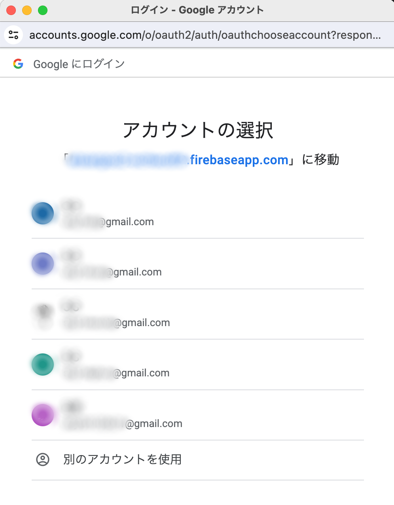
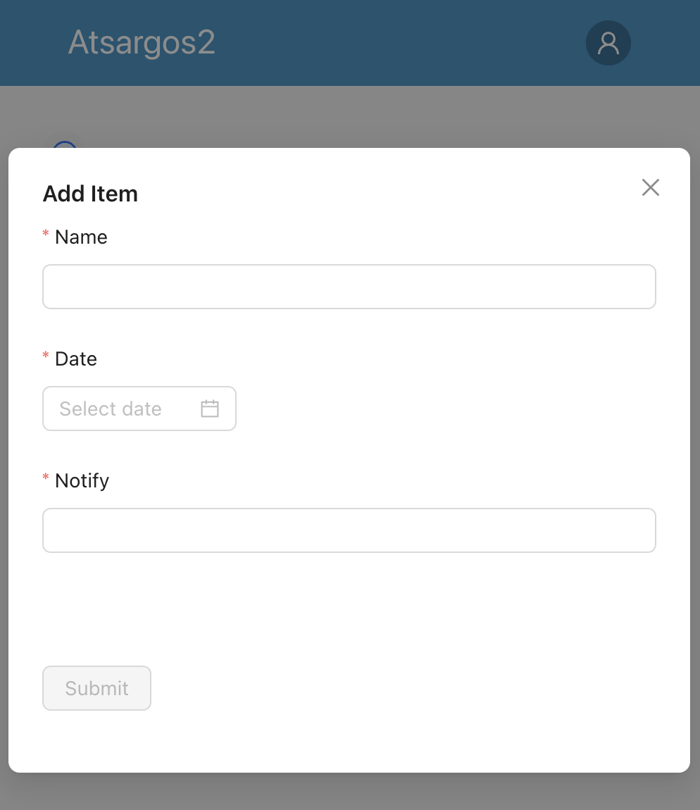
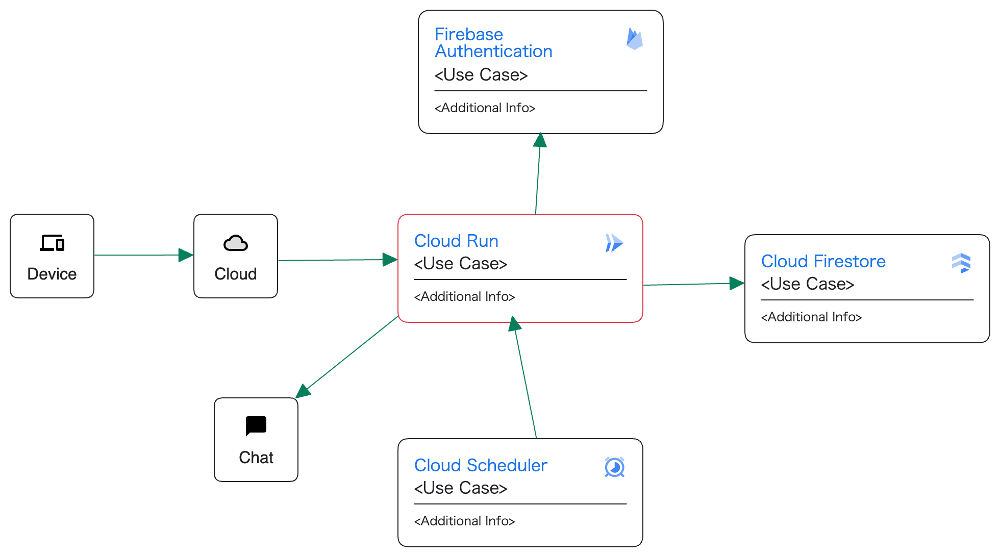

# atsargos2

最後に実行した日から指定日数を経過したらSlack通知するサービス。

以前、同様の機能で [atsargos](https://github.com/sky0621/atsargos) というリポジトリを作成したが、使用技術的に古くなったのでリニューアル。 

## 使用技術の比較

|              | atsargos                   | atsargos2                       |
|--------------|----------------------------|---------------------------------|
| frontend     | Vue.js(v2) Nuxt(v2)    | React(v18)                      |
| backend      | golang(v1.15)              | golang(v1.21)                   |
| auth         | Cloud Identity Aware Proxy | Firebase Authentication(Google) |
| CI/CD        | local command              | GitHub Actions Terraform    |
| infra        | Google Cloud(App Engine)   | Google Cloud(Cloud Run)         |
| notification | Slack                      | Slack                           |

## 画面イメージ

atsargos では画像アップロード機能もあったが、ほぼ使っていなかったので atsargos2 では実装していない。

## Architecture

